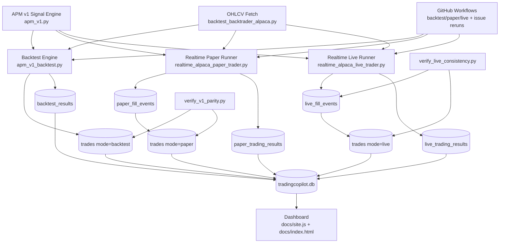

# VERSION 1 (APM v1) Reference

This document describes everything that is part of version v1 across backtest, paper trading, and live trading.

## Scope

- Strategy family: Adaptive Pullback Momentum v1
- Primary timeframe: 5m
- Primary implementation language: Python (execution) plus Pine Script (strategy template)
- Current execution support in automation: v1 is the only fully wired end-to-end version for realtime paper and realtime live runners.

## v1 Architecture Diagram

## Strategy Definition (v1)

### Pine strategy source

- File: `backend/pine_templates/APM v1.0-5m.pine`
- Purpose:
  - Canonical Pine strategy template for v1.
  - Contains entry/exit logic, risk controls, plotting, and dashboard overlays in TradingView.

### Python signal engine

- File: `backend/strategy_generator/apm_v1.py`
- Function: `apm_v1_signals(df)`
- Purpose:
  - Generates v1 entry indices from OHLCV and indicators.
  - Used by backtest, paper, and live runners.

### Python backtest engine

- File: `backend/strategy_generator/apm_v1_backtest.py`
- Function: `backtest_apm_v1(df)`
- Purpose:
  - Simulates v1 trades and equity curve from signal indices.
  - Uses ATR-based SL/TP/trailing logic and risk sizing.

### Local standalone backtest runner

- File: `backend/strategy_generator/run_apm_v1_backtest.py`
- Purpose:
  - Convenience script that loads local CSV and writes v1 trades CSV.

## Shared Data + DB Infrastructure

### Main database

- File: `docs/data/tradingcopilot.db`
- Purpose:
  - Single source for dashboard-backed trading data.
  - Stores symbols, trade rows, and summary rows for backtest/paper/live modes.

### Shared fetch/backtest utilities

- File: `backend/backtest_backtrader_alpaca.py`
- Key elements used by v1 components:
  - `DB_PATH`
  - `VERSION_MAP`
  - `fetch_ohlcv(...)`
  - `run_backtest(...)` for v1 path

## v1 Backtest Components

### Backtest runner (symbol + version)

- File: `backend/backtest_backtrader_alpaca.py`
- CLI usage:
  - `python backend/backtest_backtrader_alpaca.py --symbol "BTC/USD" --version v1`
- Behavior:
  - Fetches OHLCV.
  - Runs v1 backtest.
  - Persists summary to DB (`backtest_results`).

### v1 aligned backtest/paper reset

- File: `reset_v1_aligned_backtest_paper.py`
- CLI usage:
  - `python reset_v1_aligned_backtest_paper.py --symbol "BTC/USD"`
  - `python reset_v1_aligned_backtest_paper.py`
- Behavior:
  - Regenerates v1 rows for both `mode='backtest'` and `mode='paper'` from a single simulation output.
  - Rewrites v1 summary rows in `backtest_results` and `paper_trading_results`.
  - Creates DB backup before rewrite.

### Backtest rerun workflow trigger

- File: `.github/workflows/rerun-backtest-issue.yml`
- Trigger format:
  - GitHub issue title starts with `Rerun Backtest:`
- v1 behavior:
  - Uses `reset_v1_aligned_backtest_paper.py` when version is v1.

## v1 Paper Trading Components

### Realtime paper runner

- File: `backend/paper_trading/realtime_alpaca_paper_trader.py`
- CLI usage:
  - `python backend/paper_trading/realtime_alpaca_paper_trader.py --symbol CLM --version v1`
  - `python backend/paper_trading/realtime_alpaca_paper_trader.py --all-symbols --version v1`
- Behavior:
  - Reads v1 signal from latest bars.
  - Submits Alpaca paper short bracket orders for eligible symbols.
  - Syncs fill activities into `paper_fill_events`.
  - Mirrors fills into `trades` rows with `mode='paper'`.
  - Writes status summaries to `paper_trading_results`.

### Simulation paper runner (non-realtime)

- File: `backend/paper_trading/paper_trade_backtrader_alpaca.py`
- Purpose:
  - Simulation-based paper mode path used in some workflows for non-v1 or explicit simulation runs.

### Parity validator (v1)

- File: `backend/paper_trading/verify_v1_parity.py`
- CLI usage:
  - `python backend/paper_trading/verify_v1_parity.py --version v1`
  - `python backend/paper_trading/verify_v1_parity.py --version v1 --symbol BTC/USD`
- Behavior:
  - Compares `mode='backtest'` vs `mode='paper'` v1 trade rows.
  - CI-friendly non-zero exit code on mismatch.

### Paper trading workflows

- File: `.github/workflows/paper-trade.yml`
- Triggers:
  - Scheduled and manual
- v1 behavior:
  - Defaults to version v1.
  - Supports `execution_mode` realtime or simulation.
  - Includes optional v1 parity check in simulation flow.

### Paper rerun workflow trigger

- File: `.github/workflows/rerun-paper-trade-issue.yml`
- Trigger format:
  - GitHub issue title starts with `Rerun Paper Trading:`
- v1 behavior:
  - Uses `reset_v1_aligned_backtest_paper.py` when version is v1.

## v1 Live Trading Components

### Realtime live runner

- File: `backend/live_trading/realtime_alpaca_live_trader.py`
- CLI usage:
  - `python backend/live_trading/realtime_alpaca_live_trader.py --symbol CLM --version v1`
  - `python backend/live_trading/realtime_alpaca_live_trader.py --all-symbols --version v1`
- Behavior:
  - Loads `.env` if available.
  - Enforces safety lock: requires `ALLOW_ALPACA_LIVE_TRADING=true|1|yes`.
  - Uses v1 signal engine, computes order params, submits short bracket orders.
  - Syncs live fills into `live_fill_events`.
  - Mirrors live fills into `trades` rows with `mode='live'`.
  - Writes status summaries to `live_trading_results`.

### Live consistency validator

- File: `backend/live_trading/verify_live_consistency.py`
- CLI usage:
  - `python backend/live_trading/verify_live_consistency.py --version v1`
  - `python backend/live_trading/verify_live_consistency.py --symbol CLM --version v1`
- Behavior:
  - Reconciles `live_fill_events` with `trades(mode='live')` counts.
  - Fails on mismatched open/closed counts or invalid fill-side relationships.

### Live trading workflow (scheduled/manual)

- File: `.github/workflows/live-trade.yml`
- Triggers:
  - `schedule` (every 5 minutes)
  - `workflow_dispatch`
- Behavior:
  - Guarded execution based on `ALLOW_ALPACA_LIVE_TRADING`.
  - Runs live trader and then live consistency validator.

### Live rerun via issue (approval-gated)

- File: `.github/workflows/rerun-live-trade-issue.yml`
- Trigger format:
  - GitHub issue title starts with `Rerun Live Trading:`
- Safety gate:
  - Requires issue label `approved-live-trade`.
  - Unapproved issue requests are commented and closed.
- Behavior:
  - Runs live trader for requested symbol/version.
  - Runs live consistency validator.
  - Commits DB changes, comments result, closes issue.

## Dashboard Integration for v1

### Frontend behavior

- File: `docs/site.js`
- v1-specific integration:
  - `PAPER_TRADING_SUPPORTED_VERSIONS` includes `v1`.
  - `LIVE_TRADING_SUPPORTED_VERSIONS` includes `v1`.
  - Shows rerun buttons by dataset mode for selected version.
  - Opens issue-based rerun requests for backtest, paper, and live.

### Frontend shell

- File: `docs/index.html`
- Contains dataset mode selector for:
  - Backtest
  - Paper Trading
  - Live Trading

## Environment Variables Used by v1

### Core Alpaca credentials

- `ALPACA_API_KEY`
- `ALPACA_API_SECRET`

### Paper-specific (preferred by paper runner)

- `ALPACA_PAPER_API_KEY`
- `ALPACA_PAPER_API_SECRET`

### Live-specific (preferred by live runner)

- `ALPACA_LIVE_API_KEY`
- `ALPACA_LIVE_API_SECRET`
- Optional: `ALPACA_LIVE_BASE_URL`

### Live safety lock

- `ALLOW_ALPACA_LIVE_TRADING`
  - Required true/1/yes for live order placement.

## Known v1 Constraints

- Realtime paper/live scripts currently allow only `--version v1`.
- v1 strategy is short-biased in current execution paths.
- Crypto symbols are skipped in realtime short paths due to shorting constraints.
- Non-v1 versions may exist as templates/configs, but v1 has the most complete operational wiring across backtest/paper/live.

## Operational Runbook (v1)

### Backtest-only rerun (single symbol)

1. Run:
   - `python reset_v1_aligned_backtest_paper.py --symbol "BTC/USD"`
2. Optional validation:
   - `python backend/paper_trading/verify_v1_parity.py --version v1 --symbol "BTC/USD"`

### Paper realtime cycle (single symbol)

1. Run:
   - `python backend/paper_trading/realtime_alpaca_paper_trader.py --symbol CLM --version v1`
2. Validate parity if using simulation reset path:
   - `python backend/paper_trading/verify_v1_parity.py --version v1 --symbol CLM`

### Live realtime cycle (single symbol, guarded)

1. Set safety lock:
   - `ALLOW_ALPACA_LIVE_TRADING=true`
2. Run:
   - `python backend/live_trading/realtime_alpaca_live_trader.py --symbol CLM --version v1`
3. Validate consistency:
   - `python backend/live_trading/verify_live_consistency.py --symbol CLM --version v1`

## Quick File Index (v1)

- `backend/pine_templates/APM v1.0-5m.pine`
- `backend/strategy_generator/apm_v1.py`
- `backend/strategy_generator/apm_v1_backtest.py`
- `backend/strategy_generator/run_apm_v1_backtest.py`
- `backend/backtest_backtrader_alpaca.py`
- `reset_v1_aligned_backtest_paper.py`
- `backend/paper_trading/realtime_alpaca_paper_trader.py`
- `backend/paper_trading/paper_trade_backtrader_alpaca.py`
- `backend/paper_trading/verify_v1_parity.py`
- `backend/live_trading/realtime_alpaca_live_trader.py`
- `backend/live_trading/verify_live_consistency.py`
- `.github/workflows/rerun-backtest-issue.yml`
- `.github/workflows/rerun-paper-trade-issue.yml`
- `.github/workflows/paper-trade.yml`
- `.github/workflows/live-trade.yml`
- `.github/workflows/rerun-live-trade-issue.yml`
- `docs/index.html`
- `docs/site.js`
- `docs/data/tradingcopilot.db`
